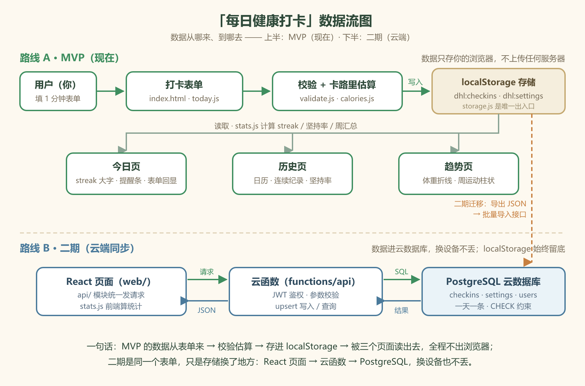

# TECH_DESIGN ·「每日健康打卡」(Daily-Health-Log)

> 版本：v1.0　撰写日期：2026-09-21
> 依据文档：PRD.md v1.1（2026-09-21）、research.md（2026-09-19）
> 读者：零基础开发者（Panky）本人，以及未来任何想接手这个项目的人
>
> **本文档的定位（2026-09-21 拍板：双路线并存）**
>
> - **路线 A（现行 MVP）**：纯前端 + localStorage，无账号无服务器。**28 天计划照旧，本路线的技术设计是"现在要做的事"。**
> - **路线 B（云端，二期）**：React/Vite + CloudBase 云函数 + PostgreSQL + 静态网站托管。**本路线的技术设计是"二期蓝图"，现在只设计、不动工。**
> - 两条路线共存于一份文档：路线 A 的数据结构已按路线 B 的字段命名对齐，将来迁移不做无谓的返工。
>
> **修订记录**
>
> | 版本 | 日期 | 改动 |
> |---|---|---|
> | v1.0 | 2026-09-21 | 初稿：方案对比、推荐路线、双路线技术设计 |
> | v1.1 | 2026-09-21 | 新增 3.0 施工顺序（Panky 拍板）；2.3 节新增数据流图（源文件 dataflow.svg，文档引用 dataflow.png，Day 5 主任务） |

---

## 〇、给零基础读者的 30 秒术语小抄

| 术语 | 一句话解释 |
|---|---|
| localStorage | 浏览器自带的小仓库（约 5MB），网页能把数据存在用户电脑上，关掉浏览器也不丢 |
| React / Vite | React 是"用积木搭页面"的前端框架；Vite 是帮你快速创建和打包 React 项目的工具 |
| 云函数 | 写好一段 Node.js 代码上传到云端，云厂商负责让它一直运行、能被网页调用——不用自己买和管理服务器 |
| PostgreSQL | 一种主流的关系型数据库，数据按"表（Excel 式的行和列）"组织，用 SQL 语言查询 |
| 静态网站托管 | 把 HTML/CSS/JS 文件上传到云端，别人访问网址就能打开——GitHub Pages、CloudBase 都提供这个 |
| API | 前端和后端约定好的"对话接口"：前端发一个请求，后端回一份数据 |
| 环境变量 | 存在运行环境里（不写进代码）的配置值，常用来放密码、地址等敏感信息 |
| BaaS | Backend as a Service，云厂商把数据库、登录、存储打包成开箱即用的服务，如 Supabase |
| 迁移 | 把数据/代码从旧方案搬到新方案的过程 |

---

## 一、技术选型对比（5 套方案）

> 对比维度：前端、后端、数据库、部署四个组件 + 零基础友好度 + 成本 + 运维负担 + 二期扩展性。
> 「成本」按个人项目用量估算，均为免费或每月几元~几十元档位。

### 1.1 五套方案速览

| | 方案一：纯前端 + localStorage | 方案二：React/Vite + CloudBase 全家桶 ★ | 方案三：React/Vite + Supabase | 方案四：Next.js + Vercel | 方案五：原生 JS + Express 自运维 |
|---|---|---|---|---|---|
| **前端** | 原生 HTML/CSS/JS | React + Vite | React + Vite | Next.js（React 全栈框架） | 原生 HTML/CSS/JS |
| **后端** | 无 | CloudBase Node.js 云函数 | Supabase（BaaS，免写后端） | Vercel Serverless Functions | Express（自己写的 Node.js 服务） |
| **数据库** | localStorage | CloudBase PostgreSQL | Supabase PostgreSQL | Neon / Vercel Postgres | SQLite（一个文件） |
| **部署** | GitHub Pages（免费） | CloudBase 静态托管 + 云函数 | Vercel / Netlify + Supabase | Vercel 一体化 | 云服务器（自己装环境、配域名） |
| **零基础友好度** | ★★★★★（无新概念） | ★★★☆☆（要学 React + 云平台） | ★★★☆☆（要学 React + BaaS 概念） | ★★☆☆☆（框架本身学习曲线陡） | ★☆☆☆☆（要懂 Linux、Nginx、安全） |
| **账号体系（二期必需）** | 无，需从零自建 | 云函数自建（JWT）或 CloudBase 登录鉴权 | **内置 Auth**，邮箱登录开箱即用 | 需自建或接第三方 | 完全自建 |
| **国内访问速度** | 快（Pages 偶尔不稳） | **快**（腾讯云国内节点） | 一般（境外节点） | 不稳定（境外节点） | 取决于服务器位置 |
| **中文文档/社区** | — | **好**（腾讯官方中文） | 一般（英文为主） | 一般（英文为主） | 好（资料多但杂） |
| **供应商锁定** | 无 | 中（云函数写法与标准 Node 服务略有差异） | 低（标准 PostgreSQL + REST） | 中 | 无 |
| **主要风险** | 换浏览器/清缓存数据全丢（PRD 已知） | PostgreSQL 属云开发的高级能力，**套餐支持度与价格需开通后确认** | 国内访问延迟；免费额度政策可能变 | 国内访问不稳定；概念多 | 运维、安全、备案全自己扛 |

### 1.2 推荐默认路线与取舍说明

**推荐：双路线并行——**

- **MVP（现在）用方案一**。理由：PRD 的核心价值在"记录成本 ≤ 1 分钟 + 坚持可视化"，单人本地数据完全够用；零基础 28 天做完的现实约束下，少一个环节就少一类报错。方案一的致命短板（换设备丢数据）恰好由二期方案二补齐。
- **二期（云端同步）用方案二**。理由：
  1. **账号 + 数据同步是二期第一优先级**，方案二四件套齐活且同一平台管理，不用在多个控制台之间跳；
  2. 国内访问快、中文文档全，对零基础排查问题最友好；
  3. PostgreSQL 是通用技能，学一次到处能用；方案五的 SQLite 属于玩具级，方案三虽然 Auth 开箱即用，但境外节点速度和英文排错是长期摩擦。

**取舍中放弃了什么（诚实记录）：**

- 放弃了方案三 Supabase 的**内置邮箱登录**——它的 Auth 确实省事，但换来的是速度和文档劣势；二期登录逻辑（注册/登录/JWT）需要自己写约 200 行云函数代码，可接受。
- 放弃了 Next.js 方案四的"一体的现代感"——框架概念（SSR、路由、服务端组件）对当前阶段是纯负担。
- 接受了方案二的**供应商锁定**：云函数的入口写法与标准 Express 略不同，但业务逻辑（校验、统计算法）可以写成平台无关的纯函数，将来搬家只改外壳不改内核。

**开通前待确认项（不阻塞当前工作）：**

1. CloudBase 当前套餐是否包含 PostgreSQL、计费方式与免费额度（开通控制台后确认，把结论记回本文档）；
2. 云函数出公网访问 PostgreSQL 的连接方式（内网直连 or 外网地址 + 密码）；
3. 静态托管默认域名是否够用（自定义域名需备案，能避则避）。

---

## 二、路线 A 技术设计（MVP 现行：纯前端 + localStorage）

### 2.1 项目结构

```
Daily-Health-Log/
├── index.html              # ① 今日打卡页（默认首页，含首次设置引导 F1）
├── history.html            # ② 历史记录页（日历 + streak + 坚持率 + 单日详情）
├── trends.html             # ③ 趋势页（体重折线 + 周运动柱状）
├── assets/
│   ├── css/
│   │   └── style.css       # 共用样式：奶油色底 + 绿色主色、圆角卡片、轻动效
│   ├── js/
│   │   ├── storage.js      # localStorage 读写封装（全项目唯一出入口，含 try/catch）
│   │   ├── calories.js     # 卡路里内置换算表（PRD 6.3）+ 估算函数
│   │   ├── validate.js     # 字段校验规则（对应 E5/B2）
│   │   ├── stats.js        # streak / 坚持率 / 每周运动汇总（纯计算，不碰 DOM）
│   │   ├── vendor/
│   │   │   └── chart.umd.js  # Chart.js 本地文件（不用 CDN，离线也能打开）
│   │   ├── today.js        # 今日页逻辑
│   │   ├── history.js      # 历史页逻辑
│   │   └── trends.js       # 趋势页逻辑
│   └── img/                # 图片素材
├── PRD.md / TECH_DESIGN.md / research.md
└── index.html 占位页（Day 2 已提交，将被上述结构替换）
```

**为什么是三个 HTML 文件而不是单页应用？** PRD 5.2 允许二选一。三个文件没有路由概念、每页一个 JS 文件各管各的，对零基础最好排查；数据共享靠 localStorage 天然实现。代价是公共代码要抽到 storage.js / stats.js 里避免复制粘贴——这条作为开发纪律执行。

### 2.2 数据模型（localStorage）

> 原则：**key 以 `dhl:` 前缀隔离**（避免和其他网站调试数据混淆）；**字段名与二期 PostgreSQL 列一一对应**（迁移时零映射成本）。

| key | 内容 | 说明 |
|---|---|---|
| `dhl:meta` | `{ "schemaVersion": 1 }` | 数据结构版本号，将来迁移/升级时程序据此判断要不要做数据转换 |
| `dhl:settings` | `{ "goalExerciseMinutes": 30, "goalWaterMl": 2000, "startDate": "2026-09-21" }` | 全局设置（PRD 6.2），只有一份；`startDate` 在首次保存打卡时自动写入，用于坚持率分母 |
| `dhl:checkins` | `{ "2026-09-21": { …单日记录… }, "2026-09-22": { … } }` | **以日期字符串为 key 的对象**：同一天天然只有一条，覆盖保存 = 给同 key 赋值（E6 免费解决） |

单日记录的字段（与 PRD 6.1 完全一致，camelCase 命名）：

```json
{
  "date": "2026-09-21",
  "exerciseType": "慢跑",
  "exerciseMinutes": 30,
  "exerciseCalories": 300,
  "mealBreakfastText": "鸡蛋 + 牛奶",
  "mealBreakfastTag": "标准",
  "mealLunchText": "轻食沙拉",
  "mealLunchTag": "清爽",
  "mealDinnerText": "",
  "mealDinnerTag": "",
  "weightKg": 65.5,
  "waterMl": 1800
}
```

约束：`date` 为 `YYYY-MM-DD` 本地日期（GMT+8）；未填项存空字符串 / 缺省，不存 null 嵌套；`exerciseCalories` 永远由 `calories.js` 计算，不接受表单输入。

### 2.3 数据流（无后端版）

> 一图总览（Day 5 主任务）：上半是 MVP 现在的数据流，下半是二期云端的数据流，橙色虚线是两者的衔接——迁移。
> （图源文件为 `dataflow.svg`，文档引用 PNG 版以兼容所有 Markdown 预览器）



```
打开页面
  → storage.js 读取（try/catch：读不到/为空 → 按 E1/E2 首次使用处理，不报错）
  → 渲染页面（今日页：streak 大字 → 提醒条 → 表单）
用户提交表单
  → validate.js 校验（体重/时长/饮水范围 → 不过则在字段旁红字，不保存，对应 E5/B2）
  → 全空拦截（至少 1 项，E3/B2）
  → calories.js 估算运动卡路里
  → storage.js 写入（try/catch：写失败 → "保存失败，请检查浏览器存储设置"，E7）
  → 页面状态更新（"今日已打卡 ✓ / 已更新今日记录"，E6）
历史/趋势页
  → storage.js 读取 → stats.js 计算 streak/坚持率/周汇总 → 渲染
    （数据不足 → 引导文案，不渲染空图，E4）
```

统计口径按 PRD F3 死磕：当前 streak 在今天未打卡时从昨天往前数；坚持率分母 = startDate 至昨天。算法集中在 `stats.js` 一处，三个页面共用，**这套纯函数二期原样搬进前端复用**。

### 2.4 错误处理对照表（PRD E1~E8 → 实现位置）

| 编号 | 场景 | 实现位置与做法 |
|---|---|---|
| E1 | 首次使用无数据 | `storage.js` 读到空 → 返回默认值对象；今日页检测无 settings → 显示设置表单 |
| E2 | localStorage 被清空 | 同 E1 处理，设置区常驻一句"数据仅存于本浏览器"提示 |
| E3 | 部分字段留空 | `validate.js`：有 ≥1 项即通过，未填项存空值 |
| E4 | 趋势数据不足 | `stats.js` 返回 `{enough: false}` → 页面显示引导文案，Chart.js 不初始化 |
| E5 | 数值越界 | `validate.js` 规则表：体重 30~200kg、时长 0~600 分钟、饮水 0~10000ml、分钟为非负整数；每条规则带文案 |
| E6 | 同日重复保存 | `dhl:checkins` 以日期为 key，直接覆盖；保存函数返回 `isNew` 布尔，页面据此显示"已打卡/已更新" |
| E7 | 写入失败 | `storage.js` 所有 `setItem` 包 try/catch，失败向上抛 → 表单显示失败文案，不清空用户已填内容 |
| E8 | 跨月日历 | `history.js` 维护当前年月状态，上月/下月按钮切换；未来日期格子渲染为不可点击 |

---

## 三、路线 B 技术设计（二期：React/Vite + CloudBase 云端）

> 本节是设计蓝图，动工前提：MVP 上线且本人连续使用满 1 个月（PRD 2.2）。

### 3.0 施工顺序（2026-09-21 Panky 拍板，二期动工按此推进）

| 步骤 | 内容 | 文档依据 | 注意点 |
|---|---|---|---|
| ① 接口契约 | 把 3.3 的 B1~B9 补全错误码明细，定稿为正式契约 | 3.3 | 契约先行，前后端各自照单开发 |
| ② 建表与种子数据 | 执行 3.2 建表 SQL + 插入种子数据 | 3.2 | 种子数据用**假日期 + 真实体重区间**——假 streak 才能验证统计算法 |
| ③ 读接口 | B6（区间查询）/ B7（单日详情） | 3.3 | 用浏览器/curl 直接看 JSON，验证最快 |
| ④ 写接口 | B8（upsert 打卡）/ B5（设置） | 3.3 | `ON CONFLICT DO UPDATE` 一条 SQL 解决覆盖保存 |
| ⑤ 数据访问层拆分 | 收拢到 `db.js`（连接池），routes 只管路由 | 3.1 | 功能跑通再拆，不过度设计 |
| ⑥ 鉴权挂上 | 除 B1/health 外全部接口加 JWT 校验 | 3.3 / 3.5 | **必须在公网暴露前完成**——裸接口任何人都能写库 |
| ⑦ 部署公网 + 跨域 | 静态托管上线 + 处理 CORS | 3.6 | CORS 在前端从托管域名发请求那一刻出现；统一走 `web/src/api/` 入口好处理 |

### 3.1 项目结构

```
daily-health-log-cloud/
├── web/                        # 前端：React + Vite
│   ├── src/
│   │   ├── pages/              # Today / History / Trends / Login / Settings
│   │   ├── components/         # 提醒条、日历、图表卡片等可复用件
│   │   ├── api/                # 封装所有后端调用（fetch + token 注入 + 错误转换）
│   │   ├── utils/
│   │   │   ├── calories.js     # 换算表（从路线 A 原样拷贝，仍在前端算）
│   │   │   ├── stats.js        # streak/坚持率（从路线 A 原样拷贝，仍在前端算）
│   │   │   └── validate.js     # 字段校验（前后端各跑一遍，前端为体验、后端为底线）
│   │   └── App.jsx
│   ├── .env.example            # 环境变量模板（真实 .env 不进 git）
│   └── package.json
├── functions/
│   └── api/                    # CloudBase 云函数（Node.js，单一入口 + action 路由）
│       ├── index.js            # 入口：解析请求 → 分发到 routes/
│       ├── routes/
│       │   ├── auth.js         # 注册 / 登录（邮箱 + 密码，JWT 签发）
│       │   ├── checkins.js     # 打卡的增查改 + 批量导入
│       │   └── settings.js     # 目标设置读写
│       ├── db.js               # PostgreSQL 连接池（复用连接，避免每请求新建）
│       └── package.json
└── docs/
```

### 3.2 数据模型（PostgreSQL）

```sql
-- 用户表：二期邮箱登录启用（密码只存 bcrypt 哈希，永远不存明文）
CREATE TABLE users (
  id            BIGSERIAL PRIMARY KEY,
  email         TEXT NOT NULL UNIQUE,
  password_hash TEXT NOT NULL,
  created_at    TIMESTAMPTZ NOT NULL DEFAULT now()
);

-- 单日打卡表：一天一条
CREATE TABLE checkins (
  id                  BIGSERIAL PRIMARY KEY,
  user_id             BIGINT REFERENCES users(id),   -- 迁移初期为 NULL（单人），开放注册后必填
  date                DATE NOT NULL,                 -- 本地日期 YYYY-MM-DD，不做 UTC 换算
  exercise_type       TEXT,
  exercise_minutes    INTEGER CHECK (exercise_minutes >= 0),
  exercise_calories   INTEGER,                       -- 前端算好后随表单提交存档
  meal_breakfast_text TEXT,
  meal_breakfast_tag  TEXT CHECK (meal_breakfast_tag IN ('清爽','标准','丰盛') OR meal_breakfast_tag IS NULL),
  meal_lunch_text     TEXT,
  meal_lunch_tag      TEXT CHECK (meal_lunch_tag IN ('清爽','标准','丰盛') OR meal_lunch_tag IS NULL),
  meal_dinner_text    TEXT,
  meal_dinner_tag     TEXT CHECK (meal_dinner_tag IN ('清爽','标准','丰盛') OR meal_dinner_tag IS NULL),
  weight_kg           NUMERIC(4,1) CHECK (weight_kg BETWEEN 30 AND 200),
  water_ml            INTEGER CHECK (water_ml >= 0),
  created_at          TIMESTAMPTZ NOT NULL DEFAULT now(),
  updated_at          TIMESTAMPTZ NOT NULL DEFAULT now(),
  UNIQUE (user_id, date)                             -- 同一用户同一天仅一条（覆盖保存=upsert）
);

-- 目标设置：每用户一条
CREATE TABLE settings (
  id                   BIGSERIAL PRIMARY KEY,
  user_id              BIGINT UNIQUE REFERENCES users(id),
  goal_exercise_minutes INTEGER NOT NULL,
  goal_water_ml         INTEGER NOT NULL,
  start_date            DATE NOT NULL
);
```

要点：数据库层的 CHECK 约束与 `validate.js` 规则表保持同一套数字——前端拦截是为了体验，数据库约束是最后的底线。

### 3.3 API 列表

> 实现方式：单一云函数 + 内部按路径/action 路由（CloudBase 云函数数量有配额，单入口最省心）。
> 除 auth 和 health 外，所有接口要求请求头带 `Authorization: Bearer <JWT>`。

| 编号 | 方法 | 路径 | 用途 | 请求要点 | 返回 | 对应 PRD |
|---|---|---|---|---|---|---|
| B1 | GET | /api/health | 健康检查 | 无 | `{ok:true}` | — |
| B2 | POST | /api/auth/register | 邮箱注册 | `{email, password}`（密码 ≥ 8 位） | `{token, user:{id,email}}` | 二期 2.2 |
| B3 | POST | /api/auth/login | 邮箱登录 | `{email, password}` | `{token, user:{id,email}}` | 二期 2.2 |
| B4 | GET | /api/settings | 读目标设置 | — | `{goalExerciseMinutes, goalWaterMl, startDate}` | F1 |
| B5 | PUT | /api/settings | 存/改目标设置 | 同 B4 返回体 | 200 空体 | F1 |
| B6 | GET | /api/checkins?from=&to= | 按日期区间批量查 | from/to 为 `YYYY-MM-DD`，单次 ≤ 400 天 | `[{...单日记录}]` | F3/F4 |
| B7 | GET | /api/checkins/:date | 单日详情 | date 路径参数 | 单日记录或 404 | F3 |
| B8 | PUT | /api/checkins/:date | 保存/覆盖打卡 | 单日记录 JSON（upsert 语义） | `{saved:true, isNew:bool}` | F2/E6 |
| B9 | POST | /api/checkins/import | 批量导入（迁移专用） | `{records:[...]}`，最多 1000 条/次 | `{imported:n}` | 迁移 |

**设计取舍：统计接口不做。** streak、坚持率、周运动汇总全部由前端 `stats.js` 计算（B6 一次拉够数据即可）。理由：复用路线 A 的现成算法，后端少写一半代码；单人数据量（一年 365 条）在前端算毫无压力。若未来用户量大到列表查询变慢，再加 `/api/stats` 接口，届时也只挪算法位置、不改规则。

### 3.4 前后端数据流（以「保存今日打卡」为例）

```
用户在 Today 页点「保存」
  1. validate.js 前端校验（不过 → 字段红字，流程终止）
  2. calories.js 算运动卡路里 → 组装单日记录 JSON
  3. api/checkinSave(date, record)：fetch PUT /api/checkins/2026-09-21
     - 自动带上 Authorization 头；按钮置为「保存中…」并禁用（防重复点击）
  4. 云函数入口解析请求 → 验 JWT → routes/checkins.js
     - 后端再校验一遍字段（数据库 CHECK 是第三道闸）
     - db.js 连接池执行 INSERT ... ON CONFLICT (user_id, date) DO UPDATE（upsert）
  5. 返回 {saved:true, isNew:false}
  6. 前端根据 isNew 显示「今日已打卡 ✓ / 已更新今日记录」
任何一步失败：
  - 网络错误/超时 → 红字"网络不给力，请重试"，表单内容不清空
  - 401 → 清除本地 token，跳转登录页
  - 400 → 把后端返回的字段错误映射到对应输入框红字
```

其余数据流同构：页面加载 → `api/` 模块并发拉 settings + checkins 区间 → `stats.js` 计算 → 渲染。**jwt 存 localStorage（单人工具可接受）**，过期前静默刷新或跳登录。

### 3.5 错误处理（云端版）

| 层 | 场景 | 处理 |
|---|---|---|
| 数据库 | 连接失败 / 约束冲突 | 云函数捕获 → 返回 500 `{error:{code:"DB_ERROR"}}`；约束冲突理论上被前置校验挡住，出现即视为 bug 记日志 |
| 云函数 | JWT 无效/过期 | 401，前端统一拦截跳登录 |
| 云函数 | 参数非法 | 400，`{error:{code:"VALIDATION", field:"weightKg", message:"体重需在 30~200kg"}}` |
| 云函数 | 未捕获异常 | 兜底 try/catch → 500 + 云函数日志（CloudBase 控制台可看），不把堆栈返回给前端 |
| 前端 | fetch 失败 / 超时（10s） | 统一在 `api/` 模块转成友好文案；页面不白屏，保留用户输入 |
| 前端 | 离线 | 提交前检测 `navigator.onLine`，离线直接提示，不发无效请求 |
| 兜底 | 任何异常 | React 错误边界（ErrorBoundary）兜住渲染错误，显示"出错了，刷新试试"，绝不白屏 |

### 3.6 环境变量

> 原则：**密钥只活在两个地方——CloudBase 控制台 / 本机 `.env` 文件；`.env` 写进 `.gitignore`，永远不进 git。** `.env.example` 提交到仓库作为模板。

**前端（`web/.env`，Vite 要求以 `VITE_` 开头才会暴露给浏览器）：**

| 变量 | 示例值（占位） | 说明 |
|---|---|---|
| `VITE_API_BASE_URL` | `https://your-env-id.service.tcloudbase.com/api` | 云函数 HTTP 访问地址 |
| `VITE_CLOUDBASE_ENV_ID` | `your-env-id` | CloudBase 环境 ID |

**云函数（在 CloudBase 控制台「云函数 → 配置 → 环境变量」里配，不落任何文件）：**

| 变量 | 说明 |
|---|---|
| `DATABASE_HOST` / `DATABASE_PORT` | PostgreSQL 连接地址（开通数据库后从控制台复制） |
| `DATABASE_USER` / `DATABASE_PASSWORD` | 数据库账号密码 |
| `DATABASE_NAME` | 库名（如 `dhl`） |
| `JWT_SECRET` | 签发登录令牌的密钥（≥ 32 位随机串，泄露 = 所有人可伪造登录） |

**开通 CloudBase 后的回填清单（从零开通视角）：** ① 开通云开发环境并记录环境 ID → 填 `VITE_CLOUDBASE_ENV_ID`；② 开通 PostgreSQL 并建库建表（执行 3.2 的 SQL）→ 拷贝连接信息进云函数环境变量；③ 部署云函数 → 把 HTTP 访问地址填进 `VITE_API_BASE_URL`；④ 静态托管上传 `web/` 构建产物。

### 3.7 迁移注意事项（路线 A → 路线 B）

1. **PRD 修订先行**：动工前按 PRD 2.2 的演进原则修订 1.2 产品说明表（"纯前端 + localStorage" → 云端描述），保持文档与现实一致。
2. **字段命名已提前对齐**：路线 A 的 localStorage 字段就是数据库列的 camelCase 版，导出即可导入，无需映射表。
3. **导出格式现在就定死**：MVP 增加一个隐藏入口或手动约定——把 `dhl:checkins` 与 `dhl:settings` 合并导出为 `{"schemaVersion":1,"settings":{…},"checkins":[…]}` JSON。二期 B9 接口按这个格式吃。
4. **导入流程安全**：先跑 B9 导入 → 抽查若干天数据与本地一致 → **确认无误后由用户手动决定是否清 localStorage**，程序永不自动删本地数据。
5. **卡路里换算表与统计算法留在前端**：不因为有了后端就挪进数据库/云函数——估算值属于展示逻辑，挪走只会增加接口复杂度。
6. **时区纪律**：`date` 全链路用 `YYYY-MM-DD` 本地日期字符串，数据库列用 `DATE` 类型；禁止任何环节把日期转成 UTC 时间戳再存，否则 GMT+8 的"今天"会错位成"昨天"。
7. **user_id 策略**：迁移初期所有数据 user_id 为 NULL（Panky 单人）；开放注册上线时，执行一条 `UPDATE checkins SET user_id = <panky的id> WHERE user_id IS NULL` 收编历史数据，此后接口一律按 token 里的 user_id 过滤（**数据隔离的关键，写死在 SQL 层**）。
8. **共存期策略**：云端稳定运行前，localStorage 始终保留（哪怕已导入云端）；确认稳定后再考虑本地只读归档。
9. **供应商锁定最小化**：业务逻辑（校验、统计、卡路里）全部写成不依赖 CloudBase API 的纯函数；云函数入口只做"收请求 → 调纯函数 → 返回"，将来搬家改壳不改核。

---

## 四、两条路线的交接清单（速查）

| 事项 | 路线 A（MVP，现在） | 路线 B（二期，设计就绪） |
|---|---|---|
| 前端 | 原生 HTML/CSS/JS，3 页 3 文件 | React + Vite，组件化复刻同样 3 页 |
| 数据存储 | localStorage（`dhl:` 前缀，schemaVersion=1） | CloudBase PostgreSQL（checkins / settings / users） |
| 后端 | 无 | CloudBase 云函数（单入口 + action 路由，JWT 鉴权） |
| 部署 | GitHub Pages | CloudBase 静态托管 |
| API 列表 | 无（本地函数调用） | B1~B9，见 3.3 |
| streak/坚持率 | `stats.js` 前端算 | **同一套算法原样复用**，仍前端算 |
| 错误处理 | E1~E8 映射表（2.4） | 三层校验 + 统一错误格式（3.5） |
| 迁移钩子 | 导出 JSON 格式（3.7 第 3 条）+ user_id 预留 | B9 导入接口 + 收编 NULL user_id |

---

## 五、附录：方案变化时哪些文件会受影响（Day 5 余力加练）

> 用途：动手改任何东西之前先查这张表，知道改动会波及哪里、要同步改哪些文档。原则：**改动尽量收敛在单一文件**（换算表只在 calories.js、统计只在 stats.js、样式只在 style.css），这就是当初把纯函数抽离的原因。

| 变化场景 | 需要改的代码 | 需要同步改的文档 | 备注 |
|---|---|---|---|
| 改卡路里换算表（如慢跑 10→11 大卡/分钟） | `calories.js`（唯一） | PRD 6.3、验收 A10 | 不碰任何页面代码 |
| 改统计口径（如坚持率分母含当天） | `stats.js`（唯一） | PRD F3、TECH_DESIGN 2.3 | 口径改动务必更新 PRD，文档是验收依据 |
| 加/减记录字段（如增加「加餐」） | `storage.js`（存取）、`validate.js`（校验）、`today.js`（表单）、`history.js`（详情展示） | PRD 6.1、TECH_DESIGN 2.2/3.2、`dataflow.svg`（如有新环节） | `dhl:meta` 的 schemaVersion +1，写迁移逻辑兼容旧数据 |
| 改配色/视觉风格 | `assets/css/style.css`（唯一） | PRD 5.2 第 4 条（如偏差大） | 三页共用一份样式，天然一致 |
| MVP → 云端（路线 A 切路线 B） | 新建 `web/`、`functions/`；`storage.js` 职责由 `web/src/api/` 接管；**stats/calories/validate 原样拷贝复用** | TECH_DESIGN 第三节整体生效、PRD 1.2 修订 | 按 3.0 施工顺序推进；迁移按 3.7 九条纪律 |
| 换云厂商（CloudBase → 其他） | `functions/api/index.js` 入口外壳、`db.js` 连接配置、环境变量 | TECH_DESIGN 3.6 | routes 里的业务纯函数不动——平台无关设计就是为这一天 |
| 新增页面（如周报复盘页） | 新 HTML + 新 `weekly.js`；复用 `storage.js`/`stats.js` | PRD 加功能节、TECH_DESIGN 2.1 结构图 | 不动已有三页 |
